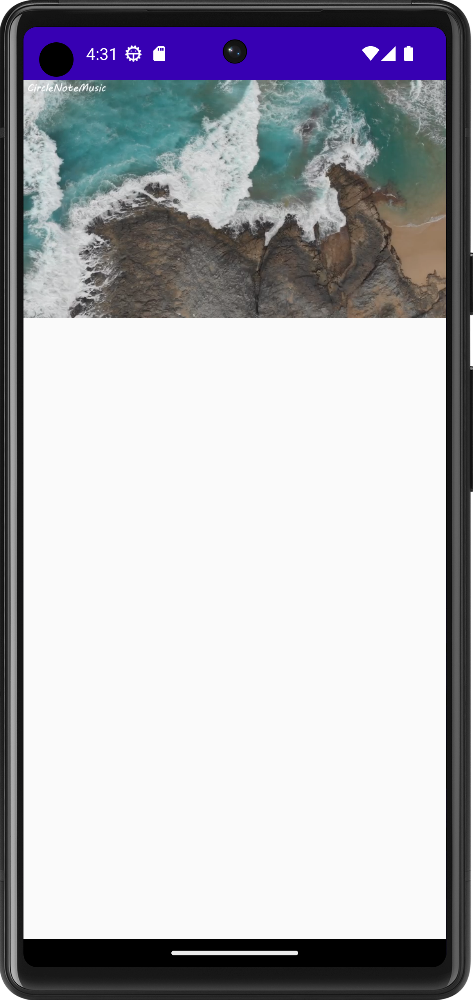

# PictureInPictureModeApp

This is a simple Picture in Picture Mode App/Project. It has all the necessary code to create a PiP Mode player and add icons and functions to the screen while in PiP mode.

It was written using: PictureInPicture, VideoView, PictureInPictureParams, Uri and Compose. 

# Demonstration

 
